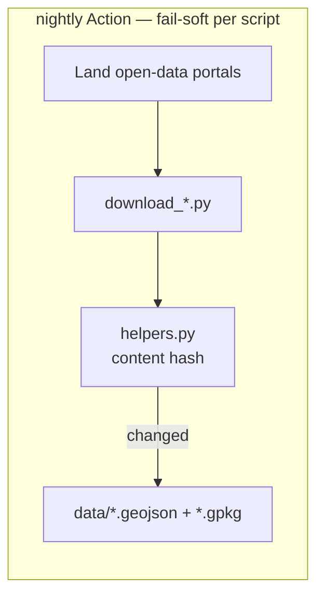

# ews-gis-assets — documentation map

This public repo publishes Austrian wind GIS datasets (GeoJSON + GPKG). The nightly
Action downloads upstream sources, content-hashes the frames, and commits `data/` only
when geometry or attributes changed.

## Where the rules live

Docs explain; **rules constrain**. Anything an agent must obey on every change lives
in [`.cursor/rules/`](../.cursor/rules/) (mirrored to `.claude/`), not here:

| Rule | Covers |
|---|---|
| `gis-project` | Public-repo privacy, `data/` ownership, uv-only commands, download entry points |
| `gis-python` | Simplest correct structure, fail fast, content hashing, docstrings that say *why* |
| `agent-config-sync` | `.cursor/` is authored, `.claude/` is generated |

Consumer-facing dataset docs (URLs, formats, update cadence) stay in the top-level
[`README.md`](../README.md).
